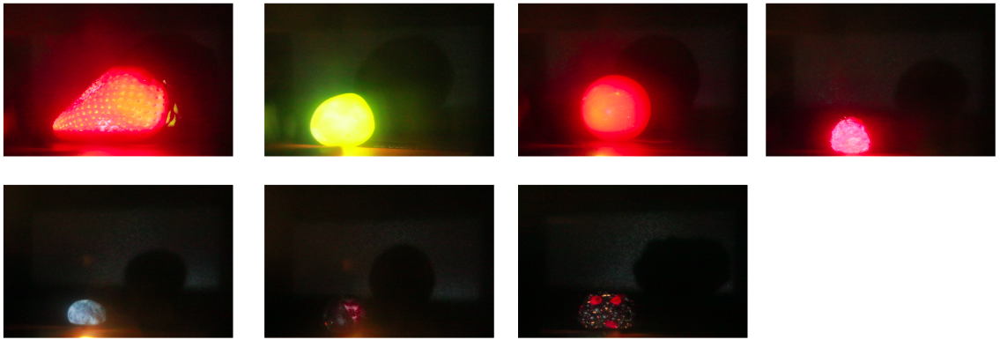

# Predict Fruit Freshness using Structured Light Data (Updating)

## Intro

This repository contains the code and resources for our research on utilizing structured light techniques fruit freshness prediction. We built our own data pipeline and collected images in various conditions, our work demonstrates that structured light methods can provide valuable information for downstream tastk. The presentation and the report could be found [here](https://docs.google.com/presentation/d/1U7qYeAOosmj36D6bmybok-jwUEahBSwIgsE5ZTu4PPo/edit#slide=id.g21238f436ba_0_633) and [here](https://arxiv.org/pdf/2212.01552.pdf). 

## Replicate

To replicate our experiments and reproduce the results, follow these steps:

1. Clone the data to your Google Drive
2. Open Colab example and point to the cloned directory

## Dataset

The dataset used in this research consists of 840 images for 7 diffent type of fruits collect in 4 consecutive days in 3 different light settings, we also include the trained weights. The detail data description could be found in our report. The dataset is available for download from the following link:

[Drive](https://drive.google.com/drive/u/1/folders/1PFBdDe0F3vG3DRO8ZFg4CDrnD8YPZSKX)

Please note that this dataset is for research purposes only and should not be used for commercial applications.

## Results

For a detailed analysis of our results and comparisons with traditional methods, please refer to our research paper.

## References

A list of cited works and resources used in this research can be found in the `references.bib` file.

